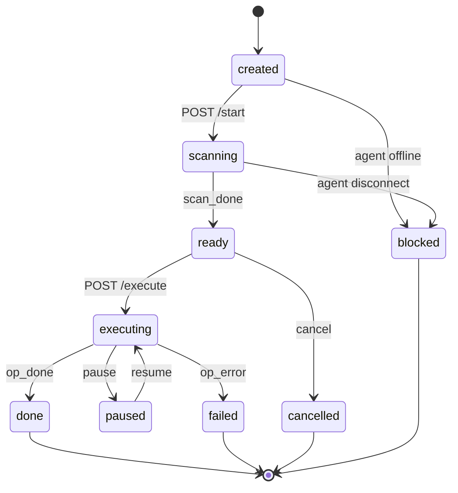

# MySQL PITR Platform

A point-in-time recovery (PITR) platform for MySQL built on [go-mysql](https://github.com/go-mysql-org/go-mysql). It continuously archives binary logs, lets you browse transactions from any point in time, and generates reverse SQL to undo accidental changes — with a web console, a multi-agent architecture, and a single-binary server.


## Features

- **误删恢复 (accidental DELETE recovery)** — reverse DELETE into INSERT from the row image
- **UPDATE 回滚** — reverse UPDATE restores the before-image values
- **指定时间恢复 (point-in-time recovery)** — scan binlogs up to an arbitrary timestamp
- **指定事务恢复 (transaction-level recovery)** — pick exact transactions by GTID or XID
- **GTID 定位** — filter candidates by a GTID set
- **大 binlog 增量归档 (incremental archiving)** — a local archive keeps a complete binlog mirror independent of MySQL's purge window, so recovery works weeks later
- **多实例管理** — one server manages many agents (one per MySQL host) over mTLS
- **检查点化执行 (checkpointed execution)** — rollbacks resume from the last committed batch after interruption

## Architecture

Three tiers: a **SvelteKit SPA** browser console, a **single-binary Go server**, and **agents** that run on the MySQL host.


| Tier | Responsibility |
|---|---|
| Browser | SvelteKit SPA (embedded in the server binary): instances, archive health, the 5-step PITR wizard, audit log, org management |
| server | REST API + SSE progress, JWT auth, mTLS WebSocket hub for agents, SQLite platform store, embeds the frontend via `go:embed` |
| agent | go-mysql based collector: `ParseFile` for local binlog files, `binlogsyncer` for incremental streaming, transaction aggregation, raw binlog reconstruction into the archive directory, and checkpointed reverse-SQL execution on the local MySQL |

### Operation state machine



The full flow: `start` scans the archive through the agent and streams transaction metadata (and reverse SQL) over SSE; you select transactions or SQL rows; `execute` runs the approved statements on the agent in batches with checkpoints; progress streams back over SSE.

## Tech Stack

| Layer | Choice |
|---|---|
| Binlog engine | [go-mysql](https://github.com/go-mysql-org/go-mysql) v1.16.0 (`replication.BinlogParser`, `binlogsyncer`) |
| Server language | Go 1.25 |
| HTTP / routing | [go-chi/chi](https://github.com/go-chi/chi) v5 |
| WebSocket | [gorilla/websocket](https://github.com/gorilla/websocket) (mTLS agent hub) |
| Auth | [golang-jwt/jwt](https://github.com/golang-jwt/jwt) v5 |
| Platform store | [modernc.org/sqlite](https://gitlab.com/cznic/sqlite) (pure Go, no CGO) |
| Web frontend | SvelteKit 2 / Svelte 5 (adapter-static, `ssr=false` SPA) |
| UI kit | Tailwind CSS v4 + [shadcn-svelte](https://shadcn-svelte.com) |
| Tests | Go `testing` + testify + sqlmock; `svelte-check` / Playwright for the frontend |

## Quick Start

### Prerequisites

- Go 1.25+（工具链经 goproxy.cn 或直接源获取 go-mysql v1.16.0）
- Node.js 22+（仅构建前端时需要；运行时前端已内嵌进二进制）
- MySQL 8.0（建议 `binlog_format=ROW`；GTID 恢复需要 `gtid_mode=ON`）

### Build

```bash
make build-web   # 构建 SvelteKit 前端并拷入 embed_build
make build       # 产出 bin/server 与 bin/agent
```

or Docker: `docker build --target server .` / `docker build --target agent .`

### Run the server

```bash
export AGENT_DATA_DIR=./data      # SQLite + CA 存放目录（默认 ./data）
export LISTEN_ADDR=:8080          # Web 控制台 + REST
export AGENT_LISTEN_ADDR=:9443    # agent mTLS 端点
./bin/server
```

Open <http://localhost:8080>, register, create an organisation, and approve the agent once it connects.

### Run the agent (on the MySQL host)

```bash
# 1. 生成加密配置（交互输入 MySQL 连接信息与归档目录）
./bin/agent config encrypt -o agent.json

# 2. 后台服务：连接 server + 启动归档循环
./bin/agent serve --config agent.json --passphrase '...'

# 3. 或命令行直接闪回（不依赖 server）
./bin/agent flashback --mysql-dsn 'user:pass@tcp(127.0.0.1:3306)/' \
  --target-table shop.orders --recovery-time '2026-08-01T00:00:00Z' --dry-run
```

Agent config reference:

```jsonc
{
  "mysql": { "host": "127.0.0.1", "port": 3306, "user": "pitr", "password": "***", "database": "" },
  "server": { "url": "wss://server-host:9443/ws/agent", "cert_file": "client.pem", "key_file": "client-key.pem", "ca_file": "ca.pem" },
  "data_dir": "/var/lib/mysql-pitr",
  "archive": { "dir": "/var/lib/mysql-pitr/archive", "server_id": 424242, "retention_days": 30 }
}
```

The MySQL account needs `SELECT`, `REPLICATION SLAVE`, `REPLICATION CLIENT` (and `SELECT` on databases you recover). The agent never sends MySQL credentials to the server.

## Web Console

- **实例** — agent list, online/offline status, approval workflow, archive health per instance
- **PITR 向导** — 5 steps: pick recovery type (误删恢复 / UPDATE 回滚 / 指定时间 / 指定事务 / GTID 定位) → set filters (tables, time range, GTID set) → watch the live scan over SSE → review and check reverse SQL grouped by transaction → execute with live progress and pause/resume/cancel
- **操作历史** — past operations with status, filter summary, and audit entries
- **审计 / 组织** — audit log with CSV export; organisations, members, invites

## Execution semantics

- Reverse SQL is generated **on the agent** (row images never leave the MySQL host); the server only displays and orchestrates.
- Executions are checkpointed in batches; an interruption rolls back only the current batch and `resume` continues from the last committed batch (the agent must be online).
- A single failing statement is recorded in `errors` and execution continues.
- If the agent disconnects mid-execution the operation becomes `blocked` (terminal) — create a new operation to redo it; duplicate-key errors are tolerated per statement.

## Testing

```bash
make test          # 单元测试（24 个包）
make test-race     # race detector（建议在 amd64 CI 上跑）
make lint          # go vet + golangci-lint
```

Integration tests (tagged `integration`, run against a real MySQL 8.0 — see `scripts/e2e/README.md`):

```bash
go test -tags integration ./internal/binlog/ -run TestE2E        # 8 个回滚场景
go test -tags integration ./internal/collector/ -run TestE2E     # 归档循环完整性
go test -tags integration ./internal/server/ -run TestE2E        # server-agent-mysql 黄金路径
```

## Project Layout

```
cmd/agent          agent CLI: serve（daemon）/ flashback / config
cmd/server         server 入口（Web + mTLS agent 端点）
internal/binlog    go-mysql 封装：Source 事件流、事务聚合、GTID
internal/scan      扫描模式（META_ONLY / WITH_SQL / SELECTED_SQL）
internal/archive   归档写入（raw 事件还原、封口验证、缺口检测）
internal/collector 归档循环（回填、增量、reconcile、状态持久化）
internal/reverse   逆向 SQL 纯函数库（agent 端生成）
internal/executor  检查点化批量执行 + 文件检查点存储
internal/stream    binlogsyncer 事件源封装
internal/daemon    agent 命令层（scan/execute/resume/cancel）
internal/ws        WebSocket 协议 + hub + mTLS CA + agent 客户端
internal/server    REST/SSE、SQLite 仓储、操作状态机、embed 前端
internal/connector MySQL 连接、schema 拉取、preflight
web                SvelteKit SPA（adapter-static）
docs/diagrams      架构图源文件（.mmd / .svg / .png / .excalidraw）
```

## References

- [go-mysql](https://github.com/go-mysql-org/go-mysql) — `git@github.com:go-mysql-org/go-mysql.git` — binlog 解析与复制协议（Apache-2.0）
- [SvelteKit](https://kit.svelte.dev) — MIT
- [shadcn-svelte](https://shadcn-svelte.com) — MIT
- [Tailwind CSS](https://tailwindcss.com) — MIT
- [modernc.org/sqlite](https://gitlab.com/cznic/sqlite) — BSD-3-Clause（`github.com/modernc.org/sqlite` 镜像）
- [go-chi/chi](https://github.com/go-chi/chi) — MIT
- [gorilla/websocket](https://github.com/gorilla/websocket) — BSD-2-Clause
- [golang-jwt/jwt](https://github.com/golang-jwt/jwt) — MIT
- [testify](https://github.com/stretchr/testify) — MIT

## License

[MIT](LICENSE) © 2026 xiaoweizano
