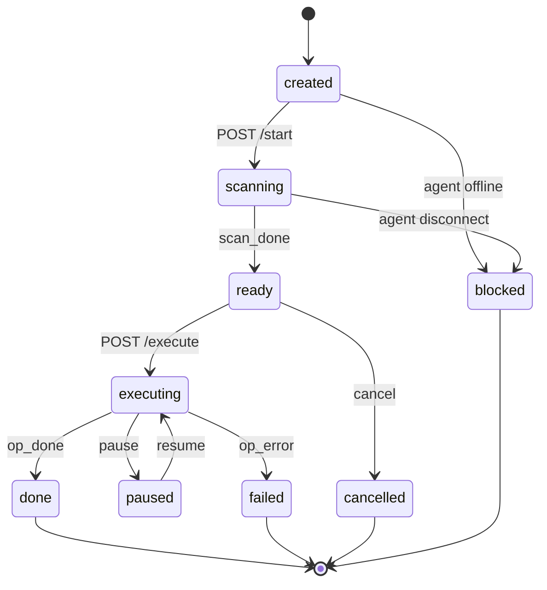

<div align="center">


# MySQL PITR Platform

A point-in-time recovery (PITR) platform for MySQL built on [go-mysql](https://github.com/go-mysql-org/go-mysql). It continuously archives binary logs, lets you browse transactions from any point in time, and generates reverse SQL to undo accidental changes — with a web console, a multi-agent architecture, and a single-binary server.

[](https://github.com/xiaoweizano/mysql-pitr/actions/workflows/ci.yml)
[](https://go.dev)
[](https://www.mysql.com)
[](https://kit.svelte.dev)
[](LICENSE)
[](https://github.com/xiaoweizano/mysql-pitr/releases)
[](https://github.com/xiaoweizano/mysql-pitr/stargazers)

English | [简体中文](README.zh-CN.md)

</div>

## Features

- **Accidental DELETE recovery** — reverse DELETE into INSERT from the row image
- **UPDATE rollback** — reverse UPDATE restores the before-image values
- **Point-in-time recovery** — scan binlogs up to an arbitrary timestamp
- **Transaction-level recovery** — pick exact transactions by GTID or XID
- **GTID targeting** — filter candidates by a GTID set
- **Incremental binlog archiving** — a local archive keeps a complete binlog mirror independent of MySQL's purge window, so recovery works weeks later
- **Multi-instance management** — one server manages many agents (one per MySQL host) over mTLS
- **Checkpointed execution** — rollbacks resume from the last committed batch after interruption

## Architecture

Three tiers: a **SvelteKit SPA** browser console, a **single-binary Go server**, and **agents** that run on the MySQL host.


| Tier | Responsibility |
|---|---|
| Browser | SvelteKit SPA (embedded in the server binary): instances, archive health, the 5-step PITR wizard, audit log, org management |
| server | REST API + SSE progress, JWT auth, mTLS WebSocket hub for agents, SQLite platform store, embeds the frontend via `go:embed` |
| agent | go-mysql based collector: `ParseFile` for local binlog files, `binlogsyncer` for incremental streaming, transaction aggregation, raw binlog reconstruction into the archive directory, and checkpointed reverse-SQL execution on the local MySQL |

### Operation state machine



The full flow: `start` scans the archive through the agent and streams transaction metadata (and reverse SQL) over SSE; you select transactions or SQL rows; `execute` runs the approved statements on the agent in batches with checkpoints; progress streams back over SSE.

## Tech Stack

| Layer | Choice |
|---|---|
| Binlog engine | [go-mysql](https://github.com/go-mysql-org/go-mysql) v1.16.0 (`replication.BinlogParser`, `binlogsyncer`) |
| Server language | Go 1.25 |
| HTTP / routing | [go-chi/chi](https://github.com/go-chi/chi) v5 |
| WebSocket | [gorilla/websocket](https://github.com/gorilla/websocket) (mTLS agent hub) |
| Auth | [golang-jwt/jwt](https://github.com/golang-jwt/jwt) v5 |
| Platform store | [modernc.org/sqlite](https://gitlab.com/cznic/sqlite) (pure Go, no CGO) |
| Web frontend | SvelteKit 2 / Svelte 5 (adapter-static, `ssr=false` SPA) |
| UI kit | Tailwind CSS v4 + [shadcn-svelte](https://shadcn-svelte.com) |
| Tests | Go `testing` + testify + sqlmock; `svelte-check` / Playwright for the frontend |

## Quick Start

### Prerequisites

- Go 1.25+ (go-mysql v1.16.0 resolves through your Go proxy or a direct source)
- Node.js 20+ (only needed to build the frontend; at runtime it is already embedded in the binary)
- MySQL 8.0 (`binlog_format=ROW` recommended; GTID recovery requires `gtid_mode=ON`)

### Build

```bash
make build-web   # build the SvelteKit frontend and copy it into embed_build
make build       # produces bin/mysql-pitr-server and bin/mysql-pitr-agent
```

or Docker: `docker build --target server .` / `docker build --target agent .`

### Docker Compose

The repo ships a `docker-compose.yml` that deploys the full stack against a **host MySQL** (no MySQL container). A one-shot `provision` service registers the agent, issues its mTLS certificate, and writes the encrypted agent config; then `agent` (with the archive loop) and `server` run persistently.

Host MySQL prerequisites:

- `log-bin=mysql-bin`, `binlog-format=ROW`, `binlog-row-image=FULL`
- an account reachable from the Docker bridge network (e.g. `'pitr'@'%'` with `SELECT, REPLICATION SLAVE, REPLICATION CLIENT`)

```bash
cp .env.example .env     # fill in MYSQL_PASSWORD and MYSQL_BINLOG_DIR_HOST
docker compose up -d
```

- `server` → http://localhost:8080 (register, create an organisation, approve the agent in the UI)
- `agent` → mounts the host binlog directory read-only (`MYSQL_BINLOG_DIR_HOST`) and runs the archive loop; archive state lives in the `agent-data` volume
- `ARCHIVE_SERVER_ID` (syncer id, unique per agent) and `ARCHIVE_RETENTION_DAYS` (0 = keep forever) are configurable via `.env`
- `PROVISION_EMAIL` / `PROVISION_PASSWORD` / `PROVISION_ORG` — the account the one-shot `provision` service registers the agent under (defaults: `e2e-provision@example.com` / `e2e-pass-123` / `E2E Org`). **The agent lives in this account's org** — log into the console with these credentials to see it. Set your own values in `.env` to register it under your account, then re-provision: `docker compose down && docker volume rm <project>_agent-config && docker compose up -d` (the old agent record stays under the old org until rejected in the UI).

The SvelteKit frontend is embedded in the server binary at build time (the Dockerfile's multi-stage build copies `web/build` into the `go:embed` tree) — there is no separate web container.

#### Low-memory servers (2C2G)

2 GB is enough to **run** the stack, but a naive `docker compose up -d --build` can take the box down: the Go compile/link peak, plus the host MySQL and the still-running old containers, exceeds available RAM — the kernel freezes and only a reboot recovers. Deploy in this order:

**1. Add swap (one-time)** — without swap, memory exhaustion kills the box; with it, builds just run slower:

```bash
fallocate -l 2G /swapfile && chmod 600 /swapfile && mkswap /swapfile && swapon /swapfile
echo '/swapfile none swap sw 0 0' >> /etc/fstab   # persist across reboots
free -h                                           # Swap should show 2.0Gi
```

> `fallocate failed: Text file busy` means the swapfile is already active — nothing to do (also check `/etc/fstab` for a duplicated line).

**2. Build the frontend locally and upload it** — the compose build uses `FRONTEND_FROM=prebuilt` so `npm ci` / Vite never run inside the container (they OOM under 2 GB). Plain `docker build --target server .` stays self-contained, but needs more than 2 GB RAM.

```bash
cd web && npm run build                # local (Node 22+)
scp -r web/build user@<server>:/path/to/project/web/build
```

**3. Build and start as separate steps** — `up -d --build` rebuilds while the old containers still hold their memory:

```bash
docker compose down
docker compose build server            # the shared builder stage fills the cache
docker compose build agent provision   # mostly cache hits
docker compose up -d
```

A build that gets OOM-killed mid-way never writes its final layers into the cache, so every retry recompiles the same step — finish one full build and later builds are fast again.

**Docker cache cleanup** — build cache grows quickly (several GB after a few iterations):

```bash
docker system df                            # see what's reclaimable
docker builder prune -a -f                  # reclaim all build cache
docker builder prune --keep-storage 1GB -f  # or cap the cache instead of wiping it
```

> ⚠️ While the stack is stopped, `docker system prune -a -f` also deletes the built `mysql-pitr` images, forcing a full rebuild on next start. Prune the **builder cache** only.

### Run the server

```bash
export AGENT_DATA_DIR=./data      # SQLite + CA storage dir (default ./data)
export LISTEN_ADDR=:8080          # web console + REST
export AGENT_LISTEN_ADDR=:9443    # agent mTLS endpoint
./bin/mysql-pitr-server
```

Open <http://localhost:8080>, register, create an organisation, and approve the agent once it connects.

### Run the agent (on the MySQL host)

```bash
# 1. Generate the encrypted config (interactive: MySQL connection + archive dir)
./bin/mysql-pitr-agent config encrypt -o agent.json

# 2. Daemon mode: connect to the server + run the archive loop
./bin/mysql-pitr-agent serve --config agent.json --passphrase '...'

# 3. Or run a one-shot flashback directly (no server involved)
./bin/mysql-pitr-agent flashback --mysql-dsn 'user:pass@tcp(127.0.0.1:3306)/' \
  --target-table shop.orders --recovery-time '2026-08-01T00:00:00Z' --dry-run
```

Agent config reference:

```jsonc
{
  "mysql": { "host": "127.0.0.1", "port": 3306, "user": "pitr", "password": "***", "database": "" },
  "server": { "url": "wss://server-host:9443/ws/agent", "cert_file": "client.pem", "key_file": "client-key.pem", "ca_file": "ca.pem" },
  "data_dir": "/var/lib/mysql-pitr",
  "archive": { "dir": "/var/lib/mysql-pitr/archive", "server_id": 424242, "retention_days": 30 }
}
```

The MySQL account needs `SELECT`, `REPLICATION SLAVE`, `REPLICATION CLIENT` (and `SELECT` on databases you recover). The agent never sends MySQL credentials to the server.

## Web Console

The console ships Chinese-first (zh-CN).

**Login** — dark theme by default, light theme via the sidebar toggle:


**Instances** — agent status, approval workflow, archive health:


**PITR wizard** — live transaction scan streaming over SSE:


- **Instances** — agent list, online/offline status, approval workflow, archive health per instance
- **PITR wizard** — 5 steps: pick a recovery type → set filters (tables, time range, GTID set) → watch the live scan over SSE → review and check reverse SQL grouped by transaction → execute with live progress and pause/resume/cancel
- **Operations** — past operations with status, filter summary, and audit entries
- **Audit / Orgs** — audit log with CSV export; organisations, members, invites

## Execution semantics

- Reverse SQL is generated **on the agent** (row images never leave the MySQL host); the server only displays and orchestrates.
- Executions are checkpointed in batches; an interruption rolls back only the current batch and `resume` continues from the last committed batch (the agent must be online).
- A single failing statement is recorded in `errors` and execution continues.
- If the agent disconnects mid-execution the operation becomes `blocked` (terminal) — create a new operation to redo it; duplicate-key errors are tolerated per statement.

## Testing

```bash
make test          # unit tests (24 packages)
make test-race     # race detector (recommended on amd64 CI)
make lint          # golangci-lint
```

Integration tests (tagged `integration`, run against a real MySQL 8.0 — see `scripts/e2e/README.md`):

```bash
go test -tags integration ./internal/binlog/ -run TestE2E        # 8 rollback scenarios
go test -tags integration ./internal/collector/ -run TestE2E     # archive loop integrity
go test -tags integration ./internal/server/ -run TestE2E        # server-agent-mysql golden path
```

## Project Layout

```
cmd/agent          agent CLI: serve (daemon) / flashback / config
cmd/server         server entrypoint (web + mTLS agent endpoint)
internal/binlog    go-mysql wrapper: source event stream, transaction aggregation, GTID
internal/scan      scan modes (META_ONLY / WITH_SQL / SELECTED_SQL)
internal/archive   archive writing (raw event reconstruction, seal verification, gap detection)
internal/collector archive loop (backfill, incremental, reconcile, state persistence)
internal/reverse   pure reverse-SQL library (generated agent-side)
internal/executor  checkpointed batch execution + file checkpoint store
internal/stream    binlogsyncer event-source wrapper
internal/daemon    agent command layer (scan/execute/resume/cancel)
internal/ws        WebSocket protocol + hub + mTLS CA + agent client
internal/server    REST/SSE, SQLite repositories, operation state machine, embedded frontend
internal/connector MySQL connection, schema fetch, preflight
web                SvelteKit SPA (adapter-static)
docs/diagrams      architecture diagram sources (.mmd / .svg / .png / .excalidraw)
```

## References

- [go-mysql](https://github.com/go-mysql-org/go-mysql) — binlog parsing and the replication protocol (Apache-2.0)
- [SvelteKit](https://kit.svelte.dev) — MIT
- [shadcn-svelte](https://shadcn-svelte.com) — MIT
- [Tailwind CSS](https://tailwindcss.com) — MIT
- [modernc.org/sqlite](https://gitlab.com/cznic/sqlite) — BSD-3-Clause (`github.com/modernc.org/sqlite` mirror)
- [go-chi/chi](https://github.com/go-chi/chi) — MIT
- [gorilla/websocket](https://github.com/gorilla/websocket) — BSD-2-Clause
- [golang-jwt/jwt](https://github.com/golang-jwt/jwt) — MIT
- [testify](https://github.com/stretchr/testify) — MIT

## Limitations

- Recovery reverses **DML only** (`DELETE` / `UPDATE`); DDL changes are not reversed.
- Requires MySQL 8.0+ with `binlog_format=ROW` and `binlog_row_image=FULL`; GTID targeting additionally requires `gtid_mode=ON`.
- Reverse SQL executes through the agent on the MySQL host; `resume` requires the agent (and its MySQL) to be online.

## License

[MIT](LICENSE) © 2026 xiaoweizano
