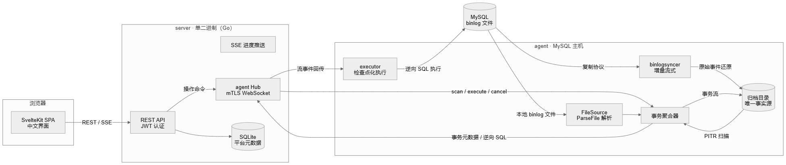
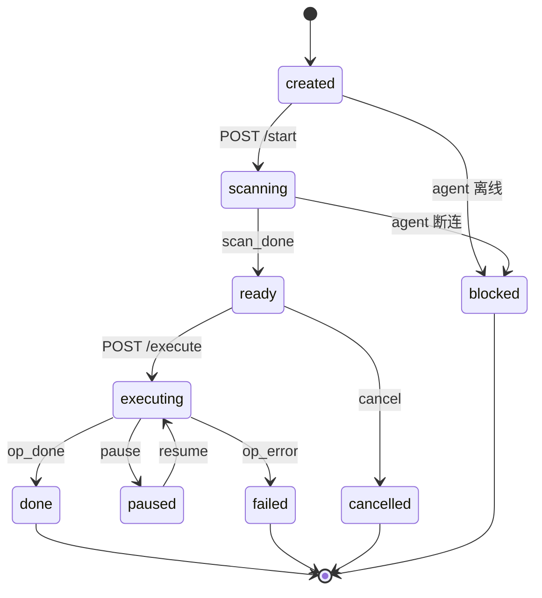

# MySQL PITR 平台

基于 [go-mysql](https://github.com/go-mysql-org/go-mysql) 的 MySQL 时间点恢复（PITR）平台。它持续归档二进制日志，让你浏览任意时间点的事务，并生成逆向 SQL 撤销误操作——自带 Web 控制台、多 agent 架构与单二进制 server。



## 功能特性

- **误删恢复**——由 DELETE 的行镜像生成逆向 INSERT
- **UPDATE 回滚**——逆向 UPDATE 恢复 Before 镜像值
- **指定时间恢复**——扫描到任意时间点的 binlog
- **指定事务恢复**——按 GTID / XID 精确定位并恢复指定事务
- **GTID 定位**——按 GTID 集过滤候选事务
- **大 binlog 增量归档**——本地归档目录保留完整的 binlog 镜像，不受 MySQL 清理窗口影响，数周后仍可恢复
- **多实例管理**——一个 server 通过 mTLS 管理多个 agent（每个 MySQL 主机一个）
- **检查点化执行**——中断后从最后已提交批次继续回滚

## 系统架构

三层：**SvelteKit SPA** 浏览器控制台、**单二进制 Go server**、以及运行在 MySQL 主机上的 **agent**。


| 层 | 职责 |
|---|---|
| 浏览器 | SvelteKit SPA（内嵌于 server 二进制）：实例管理、归档健康度、5 步 PITR 向导、审计日志、组织管理 |
| server | REST API + SSE 进度、JWT 认证、agent mTLS WebSocket hub、SQLite 平台存储、`go:embed` 内嵌前端 |
| agent | go-mysql 采集引擎：`ParseFile` 解析本地 binlog、`binlogsyncer` 增量流式、事务聚合、原始 binlog 还原进归档目录、检查点化逆向 SQL 执行 |

### 操作状态机



完整流程：`start` 经 agent 扫描归档并流式回传事务元数据（与逆向 SQL，经 SSE）；你勾选事务或 SQL 行；`execute` 在 agent 上按批次检查点执行已批准语句；进度经 SSE 流式回传。

## 技术栈

| 层 | 选型 |
|---|---|
| binlog 引擎 | [go-mysql](https://github.com/go-mysql-org/go-mysql) v1.16.0（`replication.BinlogParser`、`binlogsyncer`） |
| 服务端语言 | Go 1.25 |
| HTTP / 路由 | [go-chi/chi](https://github.com/go-chi/chi) v5 |
| WebSocket | [gorilla/websocket](https://github.com/gorilla/websocket)（mTLS agent hub） |
| 认证 | [golang-jwt/jwt](https://github.com/golang-jwt/jwt) v5 |
| 平台存储 | [modernc.org/sqlite](https://gitlab.com/cznic/sqlite)（纯 Go，无 CGO） |
| Web 前端 | SvelteKit 2 / Svelte 5（adapter-static，`ssr=false` SPA） |
| UI 组件 | Tailwind CSS v4 + [shadcn-svelte](https://shadcn-svelte.com) |
| 测试 | Go `testing` + testify + sqlmock；前端 `svelte-check` / Playwright |

## 快速开始

### 环境要求

- Go 1.25+（go-mysql v1.16.0 经 goproxy.cn 或直接源获取）
- Node.js 22+（仅构建前端时需要；运行时前端已内嵌进二进制）
- MySQL 8.0（建议 `binlog_format=ROW`；GTID 恢复需要 `gtid_mode=ON`）

### 构建

```bash
make build-web   # 构建 SvelteKit 前端并拷入 embed_build
make build       # 产出 bin/server 与 bin/agent
```

或 Docker：`docker build --target server .` / `docker build --target agent .`

### Docker Compose 部署

仓库自带的 `docker-compose.yml` 可一键部署全栈，连接的是**宿主机 MySQL**（不在容器内另起 MySQL）。一次性 `provision` 服务完成 agent 注册、mTLS 证书签发与加密配置写入；之后 `agent`（含归档循环）与 `server` 常驻运行。

宿主机 MySQL 前置要求：

- `log-bin=mysql-bin`、`binlog-format=ROW`、`binlog-row-image=FULL`
- 允许容器网段访问的账号（如 `'pitr'@'%'`，授予 `SELECT, REPLICATION SLAVE, REPLICATION CLIENT`）

```bash
cp .env.example .env     # 填写 MYSQL_PASSWORD 与 MYSQL_BINLOG_DIR_HOST
docker compose up -d
```

- `server` → http://localhost:8080（注册账号、创建组织、在界面上审批 agent）
- `agent` → 只读挂载宿主机 binlog 目录（`MYSQL_BINLOG_DIR_HOST`）并运行归档循环；归档状态存于 `agent-data` 卷
- `ARCHIVE_SERVER_ID`（syncer id，每 agent 唯一）与 `ARCHIVE_RETENTION_DAYS`（0 = 永久保留）可在 `.env` 配置

前端已由 Dockerfile 多阶段构建在编译期内嵌进 server 二进制（`web/build` 拷入 `go:embed` 树）——无需单独的前端容器。

### 启动 server

```bash
export AGENT_DATA_DIR=./data      # SQLite + CA 存放目录（默认 ./data）
export LISTEN_ADDR=:8080          # Web 控制台 + REST
export AGENT_LISTEN_ADDR=:9443    # agent mTLS 端点
./bin/server
```

打开 <http://localhost:8080>，注册账号、创建组织，并在 agent 接入后审批它。

### 启动 agent（MySQL 主机上）

```bash
# 1. 生成加密配置（交互输入 MySQL 连接信息与归档目录）
./bin/agent config encrypt -o agent.json

# 2. 后台服务：连接 server + 启动归档循环
./bin/agent serve --config agent.json --passphrase '...'

# 3. 或命令行直接闪回（不依赖 server）
./bin/agent flashback --mysql-dsn 'user:pass@tcp(127.0.0.1:3306)/' \
  --target-table shop.orders --recovery-time '2026-08-01T00:00:00Z' --dry-run
```

agent 配置参考：

```jsonc
{
  "mysql": { "host": "127.0.0.1", "port": 3306, "user": "pitr", "password": "***", "database": "" },
  "server": { "url": "wss://server-host:9443/ws/agent", "cert_file": "client.pem", "key_file": "client-key.pem", "ca_file": "ca.pem" },
  "data_dir": "/var/lib/mysql-pitr",
  "archive": { "dir": "/var/lib/mysql-pitr/archive", "server_id": 424242, "retention_days": 30 }
}
```

MySQL 账号需要 `SELECT`、`REPLICATION SLAVE`、`REPLICATION CLIENT`（以及要恢复库的 `SELECT`）。agent 永远不会把 MySQL 凭据发送给 server。

## Web 控制台

- **实例**——agent 列表、在线/离线状态、审批流程、每实例归档健康度
- **PITR 向导**——5 步：选恢复类型（误删恢复 / UPDATE 回滚 / 指定时间 / 指定事务 / GTID 定位）→ 设过滤（表、时间区间、GTID 集）→ 经 SSE 实时查看扫描 → 按事务分组审阅并勾选逆向 SQL → 执行并实时查看进度（pause / resume / cancel）
- **操作历史**——历史操作的状态、过滤摘要与审计条目
- **审计 / 组织**——审计日志（含 CSV 导出）；组织、成员、邀请

## 执行语义

- 逆向 SQL 在 **agent 端**生成（行镜像永不出 MySQL 主机）；server 只负责展示与编排。
- 执行按批次检查点推进；中断仅回滚当前批次，`resume` 从最后已提交批次继续（要求 agent 在线）。
- 单条语句失败记入 `errors` 并继续执行。
- 执行中 agent 断连会使操作置为 `blocked`（终态）——需新建操作重做；重复键错误按单条容忍。

## 测试

```bash
make test          # 单元测试（24 个包）
make test-race     # race detector（建议在 amd64 CI 上跑）
make lint          # go vet + golangci-lint
```

集成测试（`integration` tag，需真实 MySQL 8.0——见 `scripts/e2e/README.md`）：

```bash
go test -tags integration ./internal/binlog/ -run TestE2E        # 8 个回滚场景
go test -tags integration ./internal/collector/ -run TestE2E     # 归档循环完整性
go test -tags integration ./internal/server/ -run TestE2E        # server-agent-mysql 黄金路径
```

## 项目结构

```
cmd/agent          agent CLI：serve（守护进程）/ flashback / config
cmd/server         server 入口（Web + mTLS agent 端点）
internal/binlog    go-mysql 封装：Source 事件流、事务聚合、GTID
internal/scan      扫描模式（META_ONLY / WITH_SQL / SELECTED_SQL）
internal/archive   归档写入（raw 事件还原、封口验证、缺口检测）
internal/collector 归档循环（回填、增量、reconcile、状态持久化）
internal/reverse   逆向 SQL 纯函数库（agent 端生成）
internal/executor  检查点化批量执行 + 文件检查点存储
internal/stream    binlogsyncer 事件源封装
internal/daemon    agent 命令层（scan/execute/resume/cancel）
internal/ws        WebSocket 协议 + hub + mTLS CA + agent 客户端
internal/server    REST/SSE、SQLite 仓储、操作状态机、embed 前端
internal/connector MySQL 连接、schema 拉取、preflight
web                SvelteKit SPA（adapter-static）
docs/diagrams      架构图源文件（.mmd / .svg / .png / .excalidraw）
```

## 参考资料

- [go-mysql](https://github.com/go-mysql-org/go-mysql) —— `git@github.com:go-mysql-org/go-mysql.git` —— binlog 解析与复制协议（Apache-2.0）
- [SvelteKit](https://kit.svelte.dev) —— MIT
- [shadcn-svelte](https://shadcn-svelte.com) —— MIT
- [Tailwind CSS](https://tailwindcss.com) —— MIT
- [modernc.org/sqlite](https://gitlab.com/cznic/sqlite) —— BSD-3-Clause（`github.com/modernc.org/sqlite` 镜像）
- [go-chi/chi](https://github.com/go-chi/chi) —— MIT
- [gorilla/websocket](https://github.com/gorilla/websocket) —— BSD-2-Clause
- [golang-jwt/jwt](https://github.com/golang-jwt/jwt) —— MIT
- [testify](https://github.com/stretchr/testify) —— MIT

## 许可证

[MIT](LICENSE) © 2026 xiaoweizano
